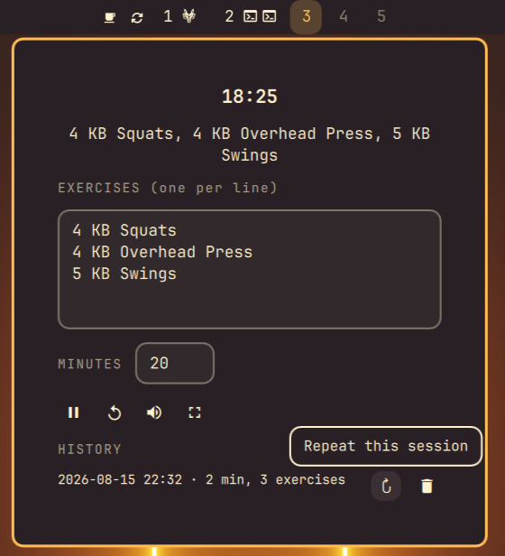
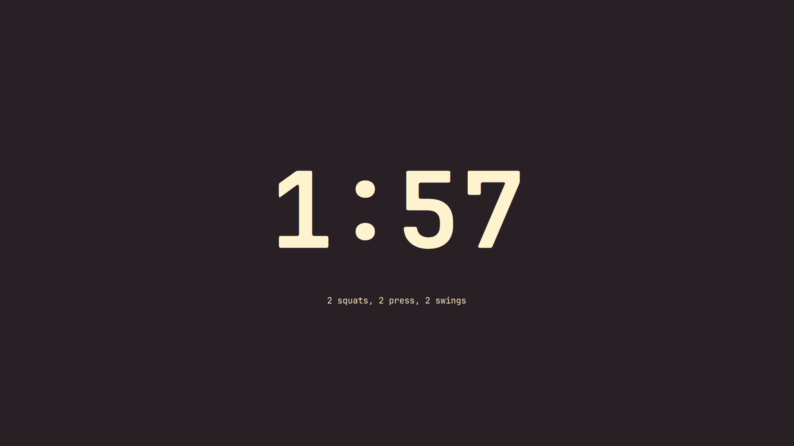
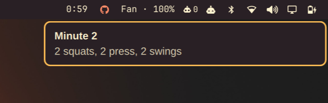

# OnTheMinute

A customizable EMOM (Every Minute On the Minute) workout timer for Omarchy.

Write your exercises, set the minutes, hit start. Get cued every minute and
on the last 5 seconds, with a history of past sessions.





## Features

Type in whatever exercises you're doing and how many minutes you want to go.
There's no fixed list, so it works for kettlebells, bodyweight circuits, or
anything else you throw at it.

You get two ways to watch the clock: a small countdown in the bar with a
dropdown for setup, or a fullscreen view if you want it visible from across
the room while you work out.

Every minute, and again on the last 5 seconds, you get a sound plus a
desktop notification, so you don't have to keep glancing at the screen.

Past workouts are saved automatically. Open the history list to see what you
did and when, or delete an entry you don't want to keep.

## Install

```bash
omarchy plugin add https://github.com/DanielLob-o/OnTheMinute.git --enable --yes
```

Or by hand:

```bash
git clone https://github.com/DanielLob-o/OnTheMinute.git ~/.config/omarchy/plugins/lobo.on-the-minute
omarchy-shell shell rescanPlugins
omarchy plugin enable lobo.on-the-minute
```

## Usage

- Click the bar widget to configure exercises and minutes, then start.
- Right-click the bar widget, or use the expand button, for the big view. Esc closes it.
- Toggle sound from the dropdown.

## Uninstall

```bash
omarchy plugin remove lobo.on-the-minute
```

Or by hand:

```bash
rm -rf ~/.config/omarchy/plugins/lobo.on-the-minute
omarchy-shell shell rescanPlugins
```

Session history lives separately at
`~/.local/state/omarchy/on-the-minute-history.json` and isn't removed by
either method.

## License

MIT, see [`LICENSE`](LICENSE).
